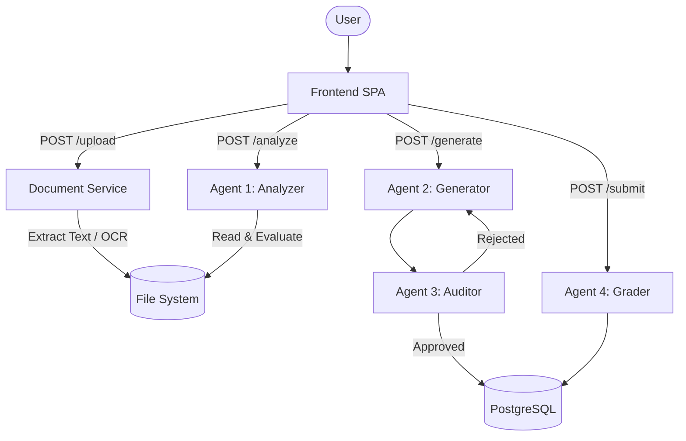

# QuizSensei — Multi-Agent LLM Assessment Platform

ระบบสร้างข้อสอบอัตโนมัติเชิงวินิจฉัยด้านความรู้ทางการเงิน (Financial Literacy) ผ่าน Multi-Agent LLM Pipeline พร้อมระบบ OCR สำหรับเอกสารภาษาไทย

## System Architecture



| Agent | Role | Output |
|-------|------|--------|
| **Analyzer** | วิเคราะห์เนื้อหา, จำแนกระดับผู้เรียน, ประเมิน Content Sufficiency | Analysis JSON |
| **Generator** | สร้างข้อสอบปรนัยตามระดับ Bloom's Taxonomy ที่กำหนด | Question Drafts |
| **Auditor** | ตรวจสอบคุณภาพข้อสอบ, ตัวเลือกหลอก, ความสอดคล้องกับ Bloom's | Approved/Rejected |
| **Grader** | วินิจฉัยคำตอบ, วิเคราะห์ Misconceptions, ให้ Feedback | Diagnostic Report |

## Tech Stack

| Layer | Technology |
|-------|------------|
| Backend | Python 3.12, FastAPI, Uvicorn |
| LLM | OpenRouter API (`/v1/completions` + `/v1/chat/completions` for Vision) |
| OCR | 3-Tier: `pypdf` → **LLM Vision** (`google/gemini-flash-1.5`) → **Tesseract** (`tha+eng`) |
| Database | PostgreSQL (asyncpg), Redis |
| Frontend | Vanilla JS SPA |
| Infrastructure | Docker Compose, Multi-stage Build |

## Quick Start

```bash
cp .env.example .env    # Configure API keys
docker compose up --build -d
# http://localhost:8000
```

**Required `.env` variables:**
```env
OPENROUTER_API_KEYS=sk-or-v1-xxxx
OPENROUTER_MODEL=nvidia/nemotron-3-super-120b-a12b:free
OPENROUTER_MODEL_OCR=google/gemini-flash-1.5:free
POSTGRES_USER=quizsensei
POSTGRES_PASSWORD=quizsensei_secret
```

## Project Structure

```
app/
├── core/              # Config, LLM client
├── models/            # SQLAlchemy models (QuestionRecord, AnswerAttempt)
├── routers/           # FastAPI endpoints (documents, exams)
├── services/
│   ├── extractors/    # PDF (3-tier OCR), DOCX, TXT extractors
│   ├── analyzers/     # Agent 1: Content analysis
│   ├── generators/    # Agent 2: Question generation
│   └── agents/        # Agent 3: Auditor, Agent 4: Grader
frontend/              # SPA (index.html, app.js, style.css)
```

## Known Limitations

| Issue | Impact | Mitigation |
|-------|--------|------------|
| File-based sidecar storage | ไม่รองรับ Horizontal Scaling | Migrate to PostgreSQL JSONB or Redis |
| Synchronous pipeline orchestration | Browser-dependent; ปิดแท็บ = pipeline หยุด | Background task queue (Celery) |
| Sequential DB writes | Data loss risk on partial failure | Batch insert with savepoints |
| No user authentication | Guest-only; ไม่มี ownership isolation | Auth middleware + user model |

---

© 2026 QuizSensei Project
