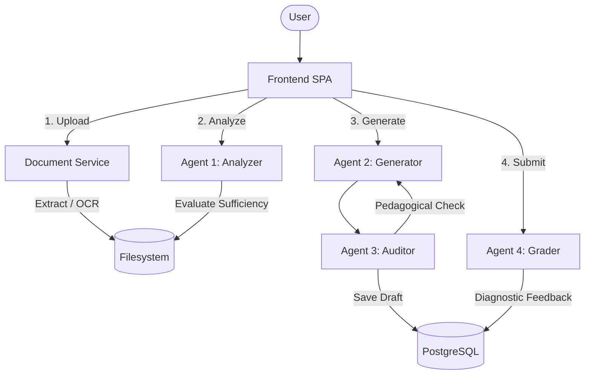

# 🧠 QuizSensei — AI-Driven Assessment Platform

QuizSensei is a next-generation assessment platform that leverages a **Multi-Agent LLM Pipeline** to transform static documents into interactive, diagnostic quizzes. Designed specifically for the **Financial Literacy** domain, it employs specialized AI agents to ensure pedagogical quality and diagnostic depth.

---

## 🚀 Key Features

*   **Multi-Agent Intelligence**: Orchestrates 4 specialized agents (Analyzer, Generator, Auditor, Grader) to handle the full assessment lifecycle.
*   **3-Tier Intelligent OCR**: 
    1.  **Digital Extraction**: Direct text parsing for high-fidelity documents.
    2.  **Vision-based OCR**: Powered by Google Gemini Flash 1.5 for complex layouts and handwritten notes.
    3.  **Tesseract Fallback**: Robust local OCR for offline or emergency processing.
*   **Bloom's Taxonomy Alignment**: Generates questions that target specific cognitive levels (Remember, Analyze, Create).
*   **Diagnostic Feedback**: Identifies specific student misconceptions and provides targeted learning guidance.
*   **Privacy-First Integration**: Clean LLM calls via OpenRouter with no identity headers (Referer/Title) and unified completions endpoints.

---

## 🏗️ System Architecture

The platform follows a clean, decoupled architecture using a hybrid storage model (Filesystem Sidecar + Relational Database).



### The 4-Agent Pipeline

| Agent | Name | Responsibility |
| :--- | :--- | :--- |
| **Agent 1** | **Analyzer** | Classifies topics, determines learner levels, and gates content sufficiency. |
| **Agent 2** | **Generator** | Transforms text into multiple-choice questions with diagnostic distractors. |
| **Agent 3** | **Auditor** | Performs quality control on pedagogical value and target audience alignment. |
| **Agent 4** | **Grader** | Analyzes answers, identifies precise misconceptions, and provides feedback. |

---

## 💻 Tech Stack

- **Backend**: Python 3.12, FastAPI, SQLAlchemy (Asyncpg)
- **Database**: PostgreSQL (Relational), Redis (Optional Cache)
- **AI/LLM**: OpenRouter (Unified `/v1/completions` endpoint)
- **Frontend**: Premium Vanilla JavaScript SPA (Vite-ready architecture)
- **Infrastructure**: Docker Compose, Multi-stage builds

---

## 🛠️ Getting Started

### Prerequisites
- Docker & Docker Compose
- OpenRouter API Key

### Installation

1.  **Clone the repository**:
    ```bash
    git clone https://github.com/QuizSensei/Nectec26.git
    cd Nectec26
    ```

2.  **Configure Environment**:
    ```bash
    cp .env.example .env
    ```
    Update `.env` with your API keys:
    ```env
    OPENROUTER_API_KEYS="sk-or-v1-..."
    OPENROUTER_URL="https://openrouter.ai/api/v1/completions"
    OPENROUTER_MODEL="nvidia/nemotron-3-super-120b-a12b:free"
    ```

3.  **Launch the System**:
    ```bash
    docker compose up --build -d
    ```
    Access the UI at `http://localhost:8000`

---

## 📁 Project Structure

```text
app/
├── core/              # Configuration & Unified LLM Logic
├── db/                # Database sessions & Base models
├── models/            # SQLAlchemy database schemas
├── routers/           # FastAPI API endpoints
├── schemas/           # Pydantic data validation models
└── services/          # Core Business Logic
    ├── agents/        # Agent 3 (Auditor) & Agent 4 (Grader)
    ├── analyzers/     # Agent 1 (Analyzer)
    ├── extractors/    # 3-Tier OCR Logic (PDF, DOCX, TXT)
    └── generators/    # Agent 2 (Question Generator)
frontend/              # Premium SPA (index.html, app.js, style.css)
```

---

## 🔒 Security & Privacy

QuizSensei respects user privacy and API security:
- **Zero-Identity Headers**: All LLM calls reach OpenRouter without `Referer` or `Title` headers.
- **Unified Endpoint**: Uses the stateless `/v1/completions` endpoint for increased consistency across models.
- **Sidecar Isolation**: Extracted text is stored in ephemeral sidecar files, isolated from the primary database.
