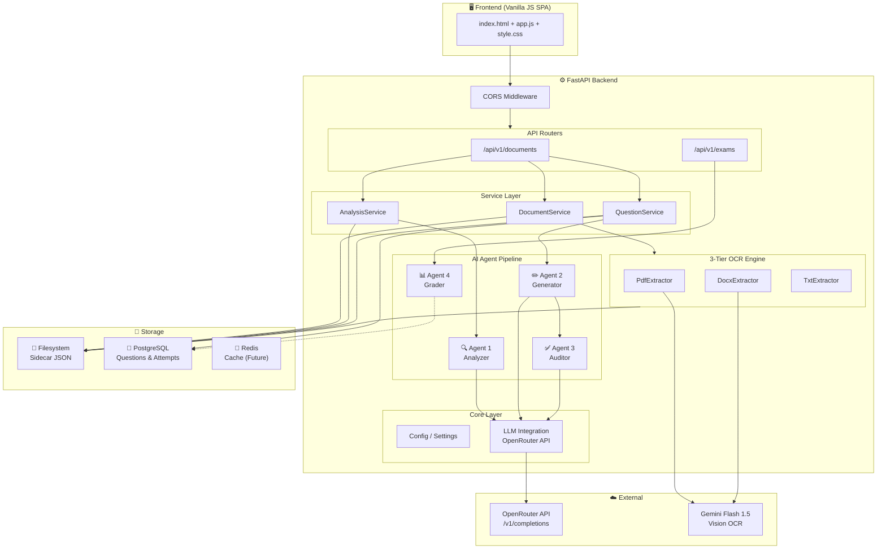
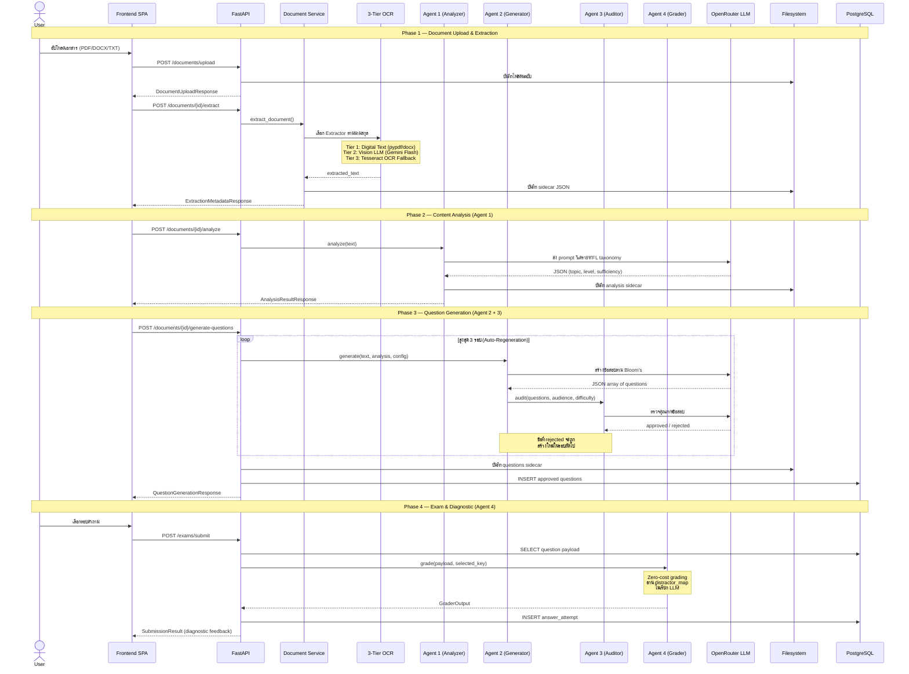
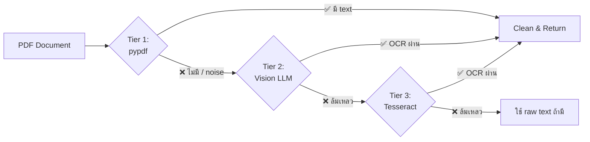

<p align="center">
  
</p>

<h1 align="center">🧠 QuizSensei</h1>

<p align="center">
  <strong>AI-Driven Diagnostic Assessment Platform for Financial Literacy</strong>
</p>

<p align="center">
  
  
  
  
  
</p>

---

QuizSensei เป็นแพลตฟอร์มสร้างข้อสอบอัตโนมัติที่ใช้ **Multi-Agent LLM Pipeline** แปลงเอกสารทางการเงินให้เป็นแบบทดสอบปรนัยเชิงวินิจฉัย (Diagnostic Assessment) พร้อมระบบตรวจคำตอบแบบอัจฉริยะที่สามารถระบุ **ความเข้าใจผิดเฉพาะเจาะจง (Misconception)** ของผู้เรียนได้

---

## 📑 Table of Contents

- [Key Features](#-key-features)
- [System Architecture](#-system-architecture)
- [Data Flow Pipeline](#-data-flow-pipeline)
- [The 4-Agent Pipeline](#-the-4-agent-pipeline)
- [3-Tier Intelligent OCR](#-3-tier-intelligent-ocr)
- [Tech Stack](#-tech-stack)
- [API Reference](#-api-reference)
- [Project Structure](#-project-structure)
- [Getting Started](#-getting-started)
- [Configuration](#-configuration)
- [Docker Deployment](#-docker-deployment)
- [Security & Privacy](#-security--privacy)

---

## ✨ Key Features

| Feature | Description |
|---------|-------------|
| **Multi-Agent Intelligence** | 4 AI agents ทำงานประสานกัน — วิเคราะห์, สร้างข้อสอบ, ตรวจคุณภาพ, ให้ Feedback |
| **3-Tier OCR** | Digital → Vision LLM (Gemini Flash) → Tesseract — รองรับทุกรูปแบบเอกสาร |
| **Bloom's Taxonomy** | ข้อสอบถูกสร้างตาม Cognitive Level: จำ/เข้าใจ, วิเคราะห์, สร้างสรรค์ |
| **Diagnostic Distractors** | ตัวเลือกผิดทุกข้อถูกออกแบบจาก Misconception ที่พบบ่อย |
| **Auto-Regeneration Loop** | ข้อสอบที่ Agent 3 ปฏิเสธจะถูกสร้างใหม่อัตโนมัติ (สูงสุด 3 รอบ) |
| **Content Sufficiency Gate** | ระบบตรวจสอบว่าเนื้อหาเพียงพอก่อนสร้างข้อสอบ |
| **Multi-Document Merge** | รวมเนื้อหาจากหลายไฟล์เพื่อสร้างข้อสอบที่ครอบคลุม |
| **Real-time Analytics** | บันทึกผลการตอบใน PostgreSQL พร้อมคำนวณ Difficulty Index (p-value) |

---

## 🏗️ System Architecture



---

## 🔄 Data Flow Pipeline

ข้อมูลไหลผ่านระบบเป็น 4 ขั้นตอนหลัก:



### Data Storage Strategy

QuizSensei ใช้ **Hybrid Storage Model** ที่ผสมระหว่าง Filesystem และ Database:

| Data | Storage | Location | Reason |
|------|---------|----------|--------|
| ไฟล์ต้นฉบับ | Filesystem | `uploads/` | ไฟล์ binary จัดเก็บตรงๆ |
| ข้อความที่สกัด | Filesystem (JSON) | `uploads/extracted/{id}.json` | Payload ขนาดใหญ่ ไม่ต้องค้นหา |
| ผลการวิเคราะห์ | Filesystem (JSON) | `uploads/analysis/{id}_analysis.json` | Intermediate result |
| ข้อสอบฉบับร่าง | Filesystem (JSON) | `uploads/questions/{id}_questions.json` | Full draft รวม rejected |
| ข้อสอบ Approved | PostgreSQL | `questions` table | ต้องค้นหา + join กับ attempts |
| ผลการตอบ | PostgreSQL | `answer_attempts` table | Analytics & p-value calculation |

---

## 🤖 The 4-Agent Pipeline

### Agent 1 — Analyzer (วิเคราะห์เนื้อหา)

**ไฟล์**: `app/services/analyzers/llm_financial_literacy_analyzer.py`

| หน้าที่ | รายละเอียด |
|---------|-------------|
| Topic Classification | จัดกลุ่มเนื้อหาตาม Financial Literacy Taxonomy (6 หัวข้อหลัก, 18 หัวข้อย่อย) |
| Learner Level Assessment | ประเมินระดับผู้เรียน: ประถม → มัธยมต้น → มัธยมปลาย → มหาวิทยาลัย → วัยทำงาน |
| Content Sufficiency Gate | ตรวจสอบว่าเนื้อหาลึกพอจะสร้างข้อสอบเจาะลึกได้หรือไม่ |
| Keyword Extraction | ดึงคำสำคัญจากเอกสารเพื่อแสดงผลให้ผู้ใช้ |

**FL Taxonomy ที่รองรับ:**
```
budgeting_and_spending     → needs_vs_wants, fixed_vs_variable_expenses, monthly_budgeting
saving_and_emergency_fund  → savings_goals, emergency_fund, delayed_gratification
credit_and_debt            → credit_cards, interest_and_repayment, good_vs_bad_debt
risk_and_insurance         → financial_risk, insurance_basics, protection_planning
investment_basics          → risk_return, simple_investing, diversification_basics
consumer_rights_and_fraud  → scam_awareness, digital_finance_safety, consumer_protection
```

### Agent 2 — Generator (สร้างข้อสอบ)

**ไฟล์**: `app/services/generators/llm_question_generator.py`

- สร้างข้อสอบปรนัย 4 ตัวเลือก (Multiple Choice) เป็นภาษาไทย 100%
- แมปความยากเป็น Bloom's Taxonomy:
  - **ง่าย** → จำ/เข้าใจ (Remember/Understand)
  - **ปานกลาง** → ประยุกต์ใช้/วิเคราะห์ (Apply/Analyze)
  - **ยาก** → วิเคราะห์/ประเมินค่า/สร้างสรรค์ (Analyze/Evaluate/Create)
- ออกแบบ **Diagnostic Distractors** ที่แต่ละตัวเลือกผิดมี:
  - `misconception` — ชื่อความเข้าใจผิด
  - `why_plausible` — ทำไมคนถึงเลือกข้อนี้
  - `diagnostic_meaning` — ข้อสรุปเชิงวินิจฉัย
  - `suggested_review_topic` — หัวข้อที่ควรทบทวน

### Agent 3 — Auditor (ตรวจคุณภาพ)

**ไฟล์**: `app/services/agents/auditor_agent.py`

| เกณฑ์ตรวจ | คำอธิบาย |
|-----------|----------|
| ระดับภาษา | ภาษาต้องเหมาะกับกลุ่มเป้าหมาย |
| Bloom's Difficulty | ความซับซ้อนต้องตรงกับ Cognitive Level ที่กำหนด |
| Design Reasoning | ต้องมีคำอธิบายว่าทำไมถึงเลือกใช้คำถามนี้ |
| Distractor Quality | ตัวเลือกผิดต้องมี misconception ที่ชัดเจน |
| ภาษาไทย 100% | เนื้อหาทั้งหมดต้องเป็นภาษาไทย |

ข้อสอบที่ไม่ผ่านจะถูก reject พร้อมระบุข้อบกพร่อง → ส่งกลับ Agent 2 สร้างใหม่

### Agent 4 — Grader (ให้คะแนน + วินิจฉัย)

**ไฟล์**: `app/services/agents/grader_agent.py`

- **Zero-cost grading** — ไม่เรียก LLM ขณะให้คะแนน
- อ่าน `distractor_map` จาก payload ที่เก็บไว้ตอนสร้าง
- คืน diagnostic message ทันทีพร้อม:
  - ระบุ misconception ที่ตรง
  - คำอธิบายหลักการที่ถูกต้อง
  - หัวข้อที่ควรทบทวน
- บันทึก `AnswerAttempt` ลง PostgreSQL เพื่อคำนวณ p-value

---

## 🔍 3-Tier Intelligent OCR



| Tier | Engine | Use Case |
|------|--------|----------|
| 1 | **pypdf** / **python-docx** | Digital-native PDFs ที่มี text layer |
| 2 | **Gemini Flash 1.5** (Vision) | Scanned documents, complex layouts, images |
| 3 | **Tesseract OCR** (tha+eng) | Local fallback เมื่อ API ใช้ไม่ได้ |

DOCX Extractor ยังสนับสนุน **embedded image OCR** — สกัดข้อความจากรูปภาพที่ฝังในเอกสาร Word

---

## 💻 Tech Stack

| Layer | Technology | Version |
|-------|-----------|---------|
| **Language** | Python | 3.12 |
| **Framework** | FastAPI | 0.115.12 |
| **ASGI Server** | Uvicorn | 0.34.0 |
| **Validation** | Pydantic | 2.11.1 |
| **ORM** | SQLAlchemy (async) | 2.0+ |
| **DB Driver** | asyncpg | 0.29+ |
| **Database** | PostgreSQL | 15 (Alpine) |
| **Cache** | Redis | 7 (Alpine) |
| **PDF Parsing** | pypdf | 5.3.0 |
| **DOCX Parsing** | python-docx | 1.1.2 |
| **PDF → Image** | pdf2image (Poppler) | 1.17.0 |
| **Local OCR** | Tesseract | tha+eng |
| **LLM Gateway** | OpenRouter | `/v1/completions` |
| **Vision OCR** | Google Gemini Flash 1.5 | via OpenRouter |
| **Container** | Docker Compose | Multi-stage build |
| **Frontend** | Vanilla JS SPA | Single-page |

---

## 📡 API Reference

### Document Endpoints (`/api/v1/documents`)

| Method | Endpoint | Description |
|--------|----------|-------------|
| `GET` | `/` | รายการเอกสารทั้งหมด |
| `POST` | `/upload` | อัปโหลดเอกสาร (PDF, DOCX, TXT, max 20MB) |
| `DELETE` | `/{document_id}` | ลบเอกสารและไฟล์ที่เกี่ยวข้อง |
| `POST` | `/{document_id}/extract` | สกัดข้อความจากเอกสาร |
| `GET` | `/{document_id}/metadata` | ดู metadata ของการสกัด |
| `GET` | `/{document_id}/preview` | ดูตัวอย่างข้อความ (500 ตัวอักษรแรก) |
| `GET` | `/{document_id}/content` | ดูข้อความเต็ม |
| `POST` | `/{document_id}/analyze` | วิเคราะห์เนื้อหาด้วย Agent 1 |
| `GET` | `/{document_id}/analysis` | ดูผลการวิเคราะห์ |
| `POST` | `/{document_id}/generate-questions` | สร้างข้อสอบด้วย Agent 2 + 3 |
| `GET` | `/{document_id}/questions` | ดูข้อสอบที่สร้าง |
| `GET` | `/{document_id}/questions/{question_id}` | ดูข้อสอบเฉพาะข้อ |

### Exam Endpoints (`/api/v1/exams`)

| Method | Endpoint | Description |
|--------|----------|-------------|
| `POST` | `/submit` | ส่งคำตอบ → Agent 4 ให้ feedback |

### Operations

| Method | Endpoint | Description |
|--------|----------|-------------|
| `GET` | `/health` | Health check |
| `GET` | `/docs` | Swagger UI |
| `GET` | `/redoc` | ReDoc |

---

## 📁 Project Structure

```
Nectec26/
├── 📄 .env                          # Environment variables (API keys, DB config)
├── 📄 Dockerfile                    # Multi-stage Docker build (builder + runtime)
├── 📄 docker-compose.yml            # Full stack: API + PostgreSQL + Redis
├── 📄 requirements.txt              # Python dependencies
├── 📄 README.md                     # This file
│
├── 📂 app/                          # Backend application
│   ├── 📄 __init__.py
│   ├── 📄 main.py                   # FastAPI app factory, middleware, router setup
│   │
│   ├── 📂 core/                     # Application core
│   │   ├── 📄 config.py             # Pydantic Settings: env vars, paths, API config
│   │   └── 📄 llm.py               # Centralized OpenRouter API: completions + vision + JSON
│   │
│   ├── 📂 db/                       # Database layer
│   │   └── 📄 session.py            # Async SQLAlchemy engine, session factory, get_db_session
│   │
│   ├── 📂 models/                   # SQLAlchemy ORM models
│   │   └── 📄 database_models.py    # QuestionRecord + AnswerAttempt tables
│   │
│   ├── 📂 routers/                  # API route handlers
│   │   ├── 📄 documents.py          # Document lifecycle: upload, extract, analyze, generate
│   │   └── 📄 exams.py              # Exam submissions: Agent 4 grading + analytics
│   │
│   ├── 📂 schemas/                  # Pydantic request/response models
│   │   ├── 📄 agent_outputs.py      # AnalyzerOutput, AuditResult, GraderOutput
│   │   ├── 📄 analysis.py           # AnalysisResultResponse
│   │   ├── 📄 document.py           # Upload, extraction, health responses
│   │   ├── 📄 exam.py               # AnswerSubmission, SubmissionResult, QuestionAnalytics
│   │   └── 📄 question.py           # QuestionDraft, Choice, GenerationRequest/Response
│   │
│   └── 📂 services/                 # Business logic layer
│       ├── 📄 document_service.py   # File management, extraction orchestration, cleanup
│       ├── 📄 analysis_service.py   # Agent 1 coordination, sidecar management
│       ├── 📄 question_service.py   # Agent 2→3 pipeline with auto-regeneration loop
│       │
│       ├── 📂 agents/               # AI Agents
│       │   ├── 📄 auditor_agent.py  # Agent 3: Quality control (LLM-based)
│       │   └── 📄 grader_agent.py   # Agent 4: Zero-cost diagnostic grading
│       │
│       ├── 📂 analyzers/            # Content Analysis
│       │   ├── 📄 base.py           # BaseAnalyzer abstract class
│       │   └── 📄 llm_financial_literacy_analyzer.py  # Agent 1: FL topic + level + sufficiency
│       │
│       ├── 📂 extractors/           # Text Extraction Strategies
│       │   ├── 📄 base.py           # BaseExtractor abstract class
│       │   ├── 📄 pdf_extractor.py  # 3-tier OCR pipeline for PDFs
│       │   ├── 📄 docx_extractor.py # DOCX parsing + embedded image OCR
│       │   └── 📄 txt_extractor.py  # Simple UTF-8 text reader
│       │
│       └── 📂 generators/           # Question Generation
│           ├── 📄 base.py           # BaseQuestionGenerator abstract class
│           └── 📄 llm_question_generator.py  # Agent 2: Bloom's-mapped question builder
│
└── 📂 frontend/                     # Single Page Application
    ├── 📄 index.html                # Main HTML structure
    ├── 📄 style.css                 # Design system and styling
    ├── 📄 app.js                    # Application logic, API calls, rendering
    └── 🖼️ logo.png                  # QuizSensei logo
```

---

## 🚀 Getting Started

### Prerequisites

- **Docker** & **Docker Compose** (recommended)
- **OpenRouter API Key** — ลงทะเบียนที่ [openrouter.ai](https://openrouter.ai)
- หรือสำหรับ local development:
  - Python 3.12+
  - PostgreSQL 15+
  - Poppler (สำหรับ `pdf2image`)
  - Tesseract OCR พร้อม Thai language pack

### Quick Start (Docker)

```bash
# 1. Clone repository
git clone https://github.com/your-org/Nectec26.git
cd Nectec26

# 2. Configure environment
cp .env.example .env
# แก้ไข OPENROUTER_API_KEYS ใน .env

# 3. Launch everything
docker compose up --build -d

# 4. Open browser
# http://localhost:8000       → Frontend UI
# http://localhost:8000/docs  → Swagger API Docs
```

### Local Development (Without Docker)

```bash
# 1. Create virtual environment
python -m venv .venv
.venv\Scripts\activate  # Windows
# source .venv/bin/activate  # macOS/Linux

# 2. Install dependencies
pip install -r requirements.txt

# 3. Start PostgreSQL (ต้อง run แยก)
# Update POSTGRES_HOST=localhost in .env

# 4. Run development server
uvicorn app.main:app --reload --host 0.0.0.0 --port 8000
```

---

## ⚙️ Configuration

ตัวแปร environment ทั้งหมดใน `.env`:

| Variable | Default | Description |
|----------|---------|-------------|
| `APP_NAME` | `QuizSensei` | ชื่อแอปพลิเคชัน |
| `APP_VERSION` | `0.1.0` | เวอร์ชัน |
| `DEBUG` | `false` | Debug mode |
| `API_PORT` | `8000` | Port ที่เปิดให้ host |
| `UPLOAD_DIR` | `uploads` | โฟลเดอร์เก็บไฟล์ |
| `MAX_FILE_SIZE_BYTES` | `20971520` | ขนาดไฟล์สูงสุด (20MB) |
| `OPENROUTER_BASE_URL` | `https://openrouter.ai/api/v1` | OpenRouter endpoint |
| `OPENROUTER_MODEL` | `nvidia/nemotron-3-super-120b-a12b:free` | โมเดล LLM หลัก |
| `OPENROUTER_MODEL_OCR` | `google/gemini-flash-1.5:free` | โมเดลสำหรับ Vision OCR |
| `OPENROUTER_API_KEYS` | — | API keys (comma-separated, round-robin) |
| `OCR_DPI` | `300` | DPI สำหรับ pdf2image |
| `OCR_MIN_CHARS_THRESHOLD` | `50` | จำนวนตัวอักษรขั้นต่ำที่ถือว่ามี text |
| `OCR_MAX_IMAGE_SIZE` | `1600` | ขนาด pixel สูงสุดของภาพ OCR |
| `POSTGRES_USER` | `quizsensei` | Database username |
| `POSTGRES_PASSWORD` | `quizsensei_secret` | Database password |
| `POSTGRES_DB` | `quizsensei_db` | Database name |
| `POSTGRES_HOST` | `db` | Database host (`db` ใน Docker, `localhost` สำหรับ local) |
| `POSTGRES_PORT` | `5432` | Database port |
| `REDIS_URL` | `redis://redis:6379/0` | Redis connection URL |

---

## 🐳 Docker Deployment

### Services

| Service | Image | Port | Purpose |
|---------|-------|------|---------|
| `api` | Custom (Python 3.12-slim) | `8000` | FastAPI application |
| `db` | `postgres:15-alpine` | `5432` | PostgreSQL database |
| `redis` | `redis:7-alpine` | `6379` | Cache (reserved for future) |

### Volumes

| Volume | Mount Point | Purpose |
|--------|-------------|---------|
| `uploads_data` | `/app/uploads` | Persist uploaded files |
| `postgres_data` | `/var/lib/postgresql/data` | Persist database |
| `redis_data` | `/data` | Persist cache |

### Commands

```bash
# Start all services
docker compose up -d

# Rebuild after code changes
docker compose up --build -d

# View logs
docker compose logs -f api

# Stop all services
docker compose down

# Reset everything (⚠️ destroys data)
docker compose down -v
```

---

## 🔒 Security & Privacy

| Aspect | Implementation |
|--------|---------------|
| **Zero-Identity Headers** | LLM calls ไม่ส่ง `Referer` หรือ `X-Title` headers |
| **Stateless API** | ใช้ `/v1/completions` endpoint ที่ไม่เก็บ conversation state |
| **API Key Rotation** | รองรับหลาย API keys แบบ round-robin |
| **Non-root Container** | Docker container ทำงานด้วย user `appuser` |
| **Path Traversal Protection** | Sanitize `document_id` ป้องกัน `../../` attacks |
| **File Size Limits** | จำกัดขนาดไฟล์ 20MB ป้องกัน abuse |
| **Sidecar Isolation** | ข้อมูลที่สกัดเก็บแยกจาก database หลัก |

---

## 📄 License

This project is developed for NECTEC 2026.

---

<p align="center">
  Made with 🧠 by the QuizSensei Team
</p>
